# Chefaa Project — Odoo 17 Customizations Status Report

Prepared by: Yousif
Date: 12 Nov 2025

## Executive Summary

- Project delivers customer-requested customizations on Odoo 17 for Chefaa.
- Five items are delivered on the test server and awaiting my testing and UAT sign‑off before production deployment:
  - Barcode available in PR (purchase request lines) and PO (purchase order lines).
  - Sales report sorted A → Z.
  - Barcode in PO Receipts: related field.
  - Return sales report title includes "RETURN" for return orders.
  - Sales reports categorized into pharmaceutical vs non‑pharmaceutical items.
- Remaining items are planned and scheduled; the final item (Item Location for Each Drug) will be addressed via filtering inside Accounting to minimize heavy code customization.

## Environments

- Test Server: Features deployed for validation. Pending UAT by me and business.
- Production Server: Will be updated post‑UAT with change controls and rollback plan.

## Overall Status Snapshot

- Delivered on Test (pending UAT/production): Barcode in PR/PO lines; Sales report A→Z; Barcode in PO Receipts; Return title; Sales report categories.
- In Analysis/Design: Item Location for Each Drug (Accounting filters approach).
- Planned/Pending: Access Rights; Master Sheet Export; Available Quantity & Value; Cost; Reports suite; Discount change via import; Select All in Return; PO Import; PO Line count.

## Deployment Plan (for test‑completed items)

- UAT: Validate against acceptance criteria below; capture screenshots.
- Release Prep: Backup, freeze window, and deploy via standard Odoo update steps.
- Rollback: Retain prior build snapshot; revert if UAT issues are found post‑deploy.

## Acceptance Criteria & Details per Request

### 1) Access Rights
- Objective: Define access rights for Inventory, Purchase, Sales, and Accounting.
- Status: Planned.
- Acceptance: Role matrices applied; users can only access permitted menus/actions.
- Notes: Align with customer security policy; document group permissions.
- Screenshot: 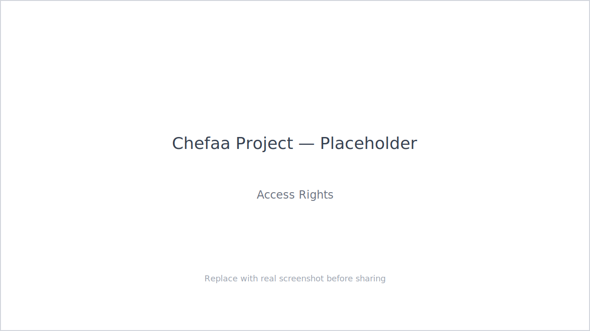

### 2) Master Sheet Export
- Objective: Export items from vendor price list with highest discount (use commercial price if stock exists).
- Status: Planned.
- Acceptance: Export reflects correct discount logic; file columns match agreed template.
- Screenshot: 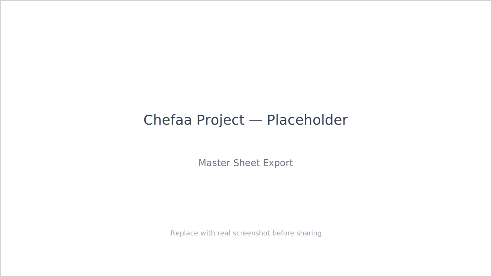

### 3) Available Quantity and Value
- Objective: Sales Order field showing available qty after receiving POs and initial value for available products.
- Status: Planned.
- Acceptance: Field calculates on SO lines with post‑PO receipts reflected accurately.
- Screenshot: 

### 4) Cost
- Objective: Show current item cost in warehouse; cost equals purchase order cost.
- Status: Planned.
- Acceptance: Cost field sources from latest PO price per configured rule.
- Screenshot: 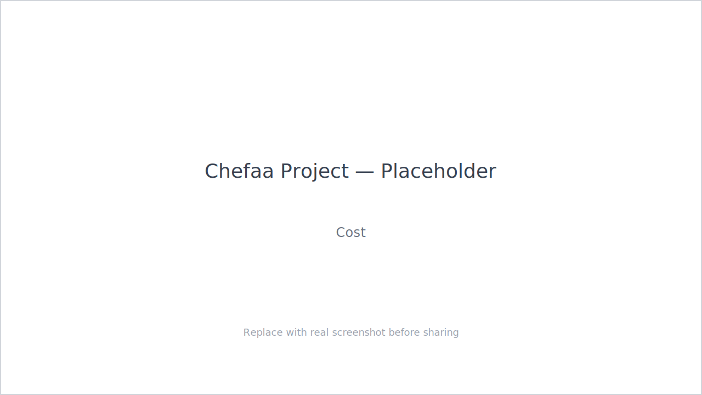

### 5) Reports
- Objective: Build reports listed by Business (Google Sheets reference).
- Status: Planned.
- Acceptance: Each report matches columns, filters, and aggregation per spec.
- Screenshot: 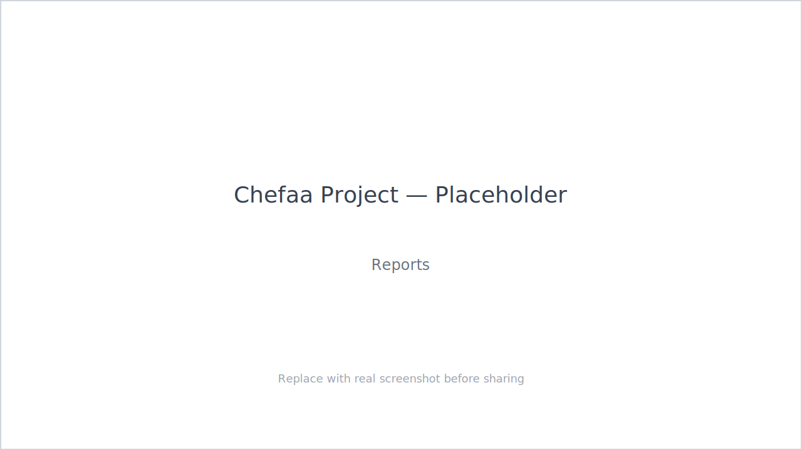

### 6) Discount (SO import)
- Objective: Update discount on Sales Orders via import.
- Status: Planned.
- Acceptance: Import updates discounts correctly without breaking existing pricing.
- Screenshot: 

### 7) Select All in the Return
- Objective: Add selection‑all in Return wizard for deliveries/receipts to return/remove.
- Status: Planned.
- Acceptance: Single action selects all applicable lines in wizard.
- Screenshot: 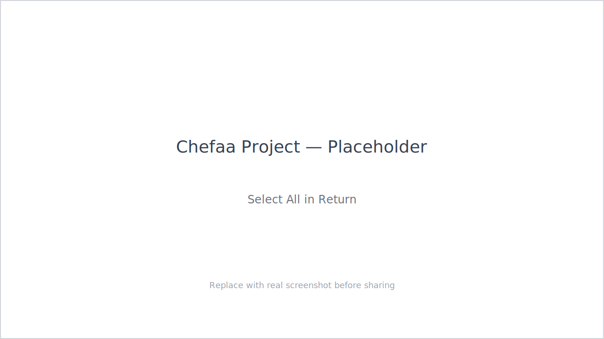

### 8) PO Import
- Objective: Import Purchase Orders from Excel (similar to SO import).
- Status: Planned.
- Acceptance: Excel import creates PO with validated lines, taxes, and vendor.
- Screenshot: 

### 9) PO Line Count
- Objective: Counter for number of lines inserted in PO (similar to SO).
- Status: Planned.
- Acceptance: Visible counter updates with line add/remove.
- Screenshot: 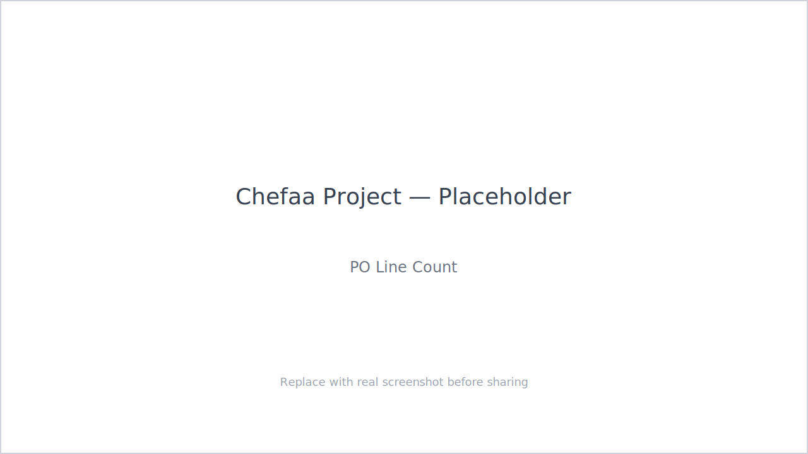

### 10) Barcode in PR & PO Lines
- Objective: Barcode available on Purchase Request lines and Purchase Order lines.
- Status: Delivered on Test; pending my testing and UAT, then production.
- Acceptance: Barcode field visible, searchable, and exported; aligns with product barcode.
- Screenshot: 

### 11) Sales Report Sorted A→Z
- Objective: Sort Sales report alphabetically A to Z.
- Status: Delivered on Test; pending UAT and production.
- Acceptance: Default sort is ascending by Name (or configured key); persists across sessions.
- Screenshot: 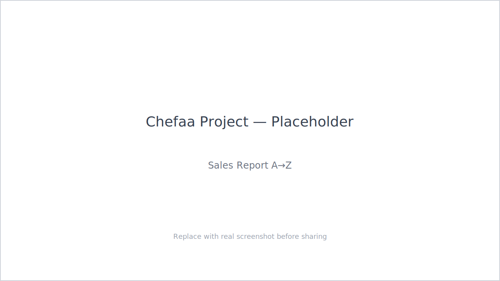

### 12) Barcode in PO Receipts (Related Field)
- Objective: Show barcode in PO Receipts via related field.
- Status: Delivered on Test; pending UAT and production.
- Acceptance: Barcode displays correctly on receipt lines; matches product barcode.
- Screenshot: 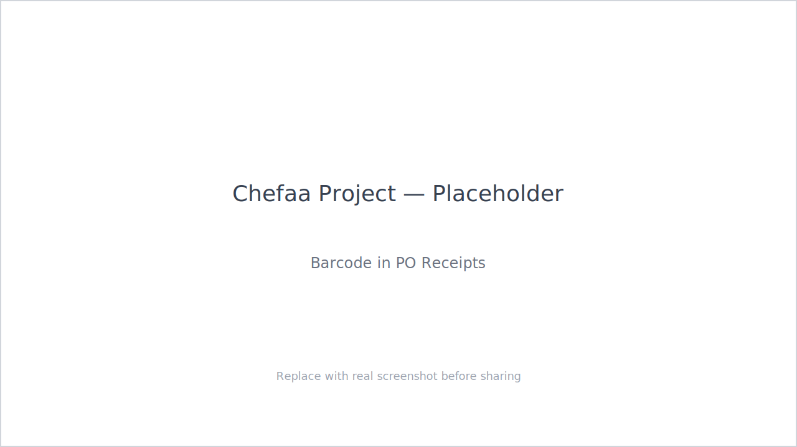

### 13) Return Title in Sales Report
- Objective: Add title "RETURN" for return orders in sales report.
- Status: Delivered on Test; pending UAT and production.
- Acceptance: Return orders labeled clearly and filterable.
- Screenshot: 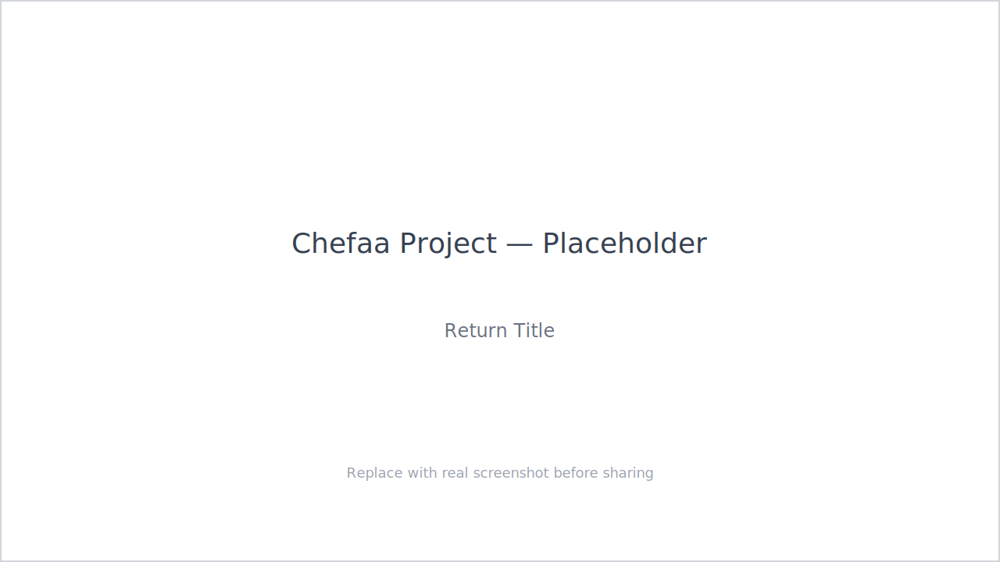

### 14) Categorize Sales Report (Pharma vs Non‑Pharma)
- Objective: Categorize sales reports into pharmaceutical and non‑pharmaceutical items.
- Status: Delivered on Test; pending UAT and production.
- Acceptance: Filters and totals available by category; category derived per product setup.
- Screenshot: 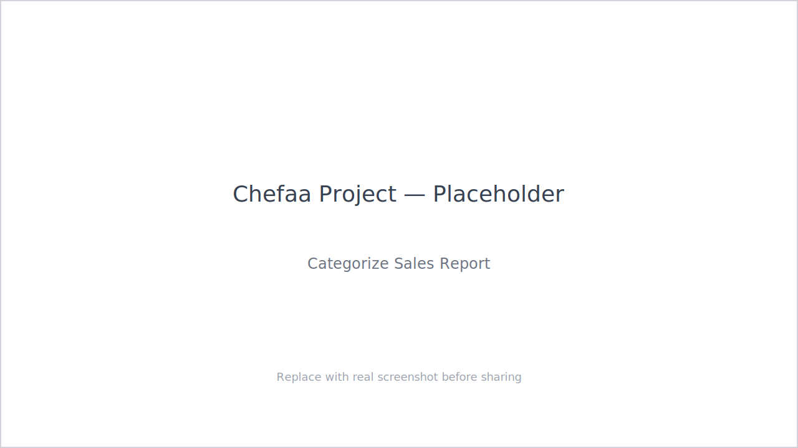

### 15) Item Location for Each Drug
- Objective: Show item location for each drug without opening each item individually; support daily inventory counting.
- Approach: Implement saved filters/views inside Accounting (clean, minimal customization).
- Status: In Analysis/Design.
- Acceptance: Quick filter reveals external stock sheet location per drug.
- Screenshot: 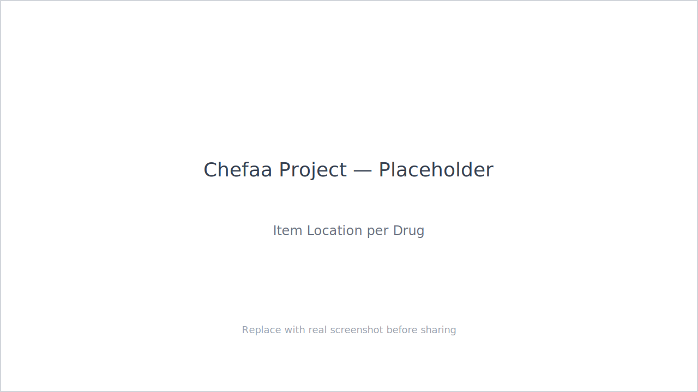

## Change Control & Quality Gates

- Code Review: Internal review prior to moving from test to production.
- Testing: Functional tests per acceptance criteria; screenshots captured and attached.
- Documentation: This report plus in‑line notes in Odoo for affected models/views.

## How to Replace Placeholder Images

1. Capture screenshots for each item on the test or production server.
2. Save images into `docs/images/` keeping the same file names as the placeholders.
3. Ensure resolution is at least 1280×720 for clarity.
4. Replace `.svg` files with `.png` or `.jpg` as needed and update links.

## Next Steps

- Complete my testing for delivered items; collect evidence.
- Schedule UAT with business; capture sign‑off.
- Prepare production deployment window; execute and verify.
- Finalize Accounting filter solution for item location use‑case.

## Appendix — References

- Customer Request Sheet: Google Sheets link provided.
- Odoo 17 Modules touched: Inventory, Purchase, Sales, Accounting, Reporting.